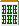
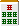
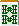
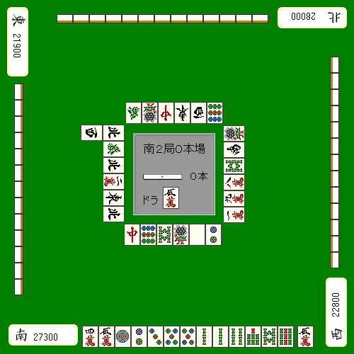

# 宝瓷砖切割时机

我想一直困扰我的是何时切割宝藏瓷砖。

不能太早，也不能太晚。

## 角色牌是宝藏牌的情况

听到最麻烦的就是宝藏牌，这是角色牌。

什么时候是最佳修剪时间？如果你问我

回答**第一次射击**或**木偶时间**。

出于某种原因，第一枪更好。

这是因为，刚开始时，第一枪是最难击中的。

例如，如果最后一局游戏的牌是这样发的，

**例１**
　　ツモ　　宝牌

您应该剪切 。

是一手看似平和、有条理的好牌，只要上去了，就没有必要持有宝牌。

然而，只有极少数情况下，仅仅上升就足够了。

只需将它们堆叠在一起并制成头部即可大大提高您的分数。

在大多数情况下，它们是为 RBI 保存的。

**示例2**
　Tsumo 宝藏瓷砖

こんなイー向听で宝牌を切り出すのは論外です。

宝牌を重なればアタマに使えてマンガンが狙える。

“长时间持有宝牌有危险……”不是理由。

这显然是错误的想法。

如果宝藏牌被揭开，所有牌都会变成危险牌。

在这手牌中，当你落地牌时，就到了切宝牌的时候了。宝物牌是恢复宣言牌是正确的。

### 理论/总结

在宝藏瓷砖之前切掉不必要的瓷砖。

当 。

☆ Tsumo

 如果是齐一象棋，就值得砍宝牌了。

另外，src="../hai/sou7m.gif" style="display:inline;vertical-align:middle;margin:0 1px;" width="19" height="26"/> 您也可以考虑将其剪成包含烤盘的形状。

☆　　ツモ

宝牌が切り出しやすいときや、どうしてもアガリにかけたいときはここで宝牌を放します。 

具体的には

- 家长号码
- 早期阶段没有人设置它
- 宝藏牌已经开始使用

情况就是这样。

如果条件合适，可以用一象棋来切。

    不过，玩得不小心就不好了，比如即使有不需要的牌，也先切掉宝藏牌。

## 其他案例

我自己并不是一个非常看重宝藏牌的玩家。

我认为没有必要有一个限制接受度的宝藏牌。

**示例3**
 Tsumo 宝藏瓷砖

如果是这样的话，我会毫不犹豫地砍宝瓦。

尺寸不同，还有和平、一封信、e-peko等角色的可能性。

我觉得没有必要留下宝藏瓷砖。

**示例4**

没有理由不能使用两张宝藏牌，但是

如果你想优先玩agari，宝藏瓷砖切割是最宽的。 （参见瓷砖效果章节）

 的替代者将成为和平易象奇，

看四位玩家持有的积分，根本不需要那么高的招式，所以这应该是宝牌切。

如果是易象棋，优先考虑广度比宝藏牌要好。

我认为这在大多数情况下都是正确的。

然而，如果宝物牌被切割的话，转移可能性较高的情况则不在此限。

