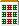
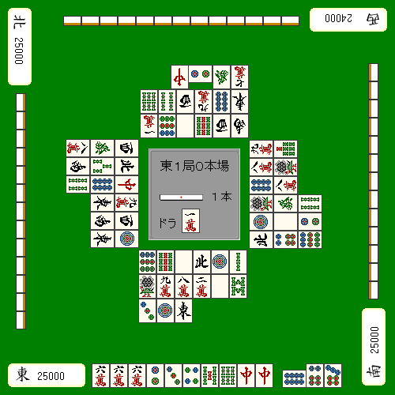
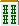

# 情况和牌手工(1)

让我们考虑一下适合旅行的手工制品。

回合数取决于丢弃的牌的等级。

- 早期阶段（第一轮至第六轮）
- 中盤　（７～１２巡）
- 决赛阶段（第13轮至第18轮）

最好分三种不同的情况来考虑。

**<基本思想>**

- 前期追求角色潜力，注重形式。
- 从游戏中期开始，首先要考虑的就是放入棋子，并根据走法，准备应对其他家族的攻击。
- 如果球队无法参加最后阶段的比赛，安全将成为焦点。

让我用一个具体的例子来解释一下。

**示例1**
宝牌

例如，此手形牌 ，被男人之剑切割并接收。
 
击球的最佳方法是立即击球，但是

如果还很早，最好遵循 RBI 并删除  从后面看。

**示例2**
宝牌

在示例 2 中，最佳选择是剪切  不带瞳孔。

Pins from，都是一个好的搭子，
 
剑也有很多变化。

然而，在游戏中期之后，针脚会变得更细，你可能无法指望有太大的变化。

在这种情况下，请使用  来剪切它。

让我们希望通过绘制宝牌来改变剑的搭子或三色旗。
 
根据剑牌的弃牌情况，有时您可能应该立即打顺子。

**示例3**
宝牌

在示例 3 中，如果只是为了提高效率，最好的选择是删除 。

唯一的损失是 ，所以应该没有任何异议。

然而，如果你在比赛中期后处于这种状态，我认为最好优先考虑防守而不是牌效率。
 
请注意，在没有宝牌的情况下向梁象棋伸出手是危险的。

保留安全牌是安全的  并将手放在别针上。

游戏结束时有一个正式的主题作为主题。
 
 当弃牌到达第三行时，最好优先考虑正式牌而不是琼脂牌。

**示例4**

为了和牌目的，理论上是剪切 ，

如果您不介意格式， 是正确的选择。

如果您的目标是图钉，请剪切 。

**示例5**

最后有一个稍微高级的技术。
 
示例5是来自另一个家庭的玩家试图恢复的情况，他在游戏结束时赢得了一张状态卡。

 是从上层房屋切下来的。  有两块棋子在玩。
 
当然，你不会赢，但你是否错过了它并到达了津毛山？

这是一个结结巴巴的剪辑。
 
这样，即使你下次抽到危险的牌，你也可以通过再次切割来保留泰姆牌。

吃吃

---

---

原始日文页：<http://beginners.biz/joukyou/joukyou03.html>
