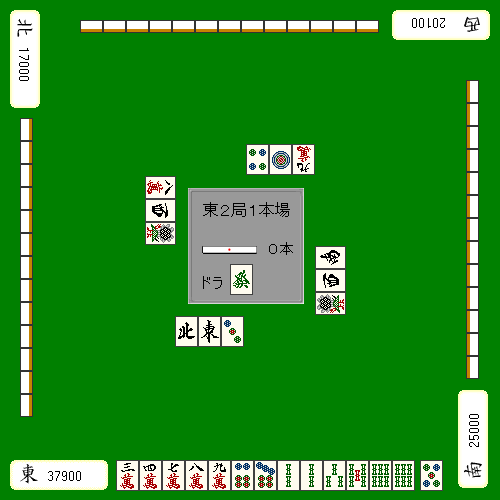
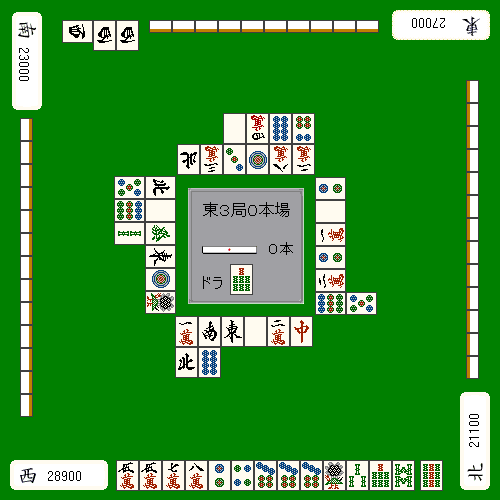
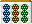

# 局况与手作（2）

接下来继续讨论“根据场况做手作”。
除了看自己手牌，还要看场上已经打出的牌与他家的副露，
有些局面必须主动调整牌效率思路。

## 对应“薄牌”

先看场上已经打出的牌，判断自己需要的牌还剩多少。
这是局况判断里最基础的一步。

**例1**

这手要拆哪边的索子两面？

答案其实就在场上。
如果  已经切出2枚，那么当然应打 。

## 识别“强势花色”

**例2**

亲家副露了客风 ，明显在做索子混一色。

自家宝牌面子已经完成，一向听；
因为面子超载，需要选择拆索子坎张还是饼子坎张。

虽然两边场上都只切出1枚，但真正要看的，是整张桌上饼子与索子的总切出量。

1. 饼子切得多，说明多数人不太需要饼子。
2. 索子切得少，说明索子更可能被他家握在手里。

这种“场上切得多”的花色，叫做“场上便宜”；
切得很少的花色，叫做“场上高”。

一般来说，等“场上便宜”的花色更容易和。

所以即使坎  最多只有3枚，它仍然可能是更好的待牌。
因为便宜花色不但别人更难使用，也更容易形成一发通过、无机会等局面，实战和牌率常高于纸面枚数。

因此这里应拆 。
若因为过度顾忌亲家的染手而去碰饼子，反而显得保守过头。

若是取坎  立直，
待牌花色正好与亲家的混一色重叠，基本不可能从两侧打出，
还容易吃到亲家的反击，实际上更危险。

## 对应副露形态

**例3**  
下家  
 吃 碰

自家  
 吃 自摸

像这种明显是全带幺九系副露时，如果两边都没现物，
当然应切 。
因为幺九系副露更容易在中张周边留下危险复合形。

---

**例4**  
上家  
 碰 碰

自家  
 碰 自摸

如果场上明显有人在做对对和，
那么“没露出来的牌”用作双碰待的风险会显著更高。

所以例4若要打，应当打 。

即使  已经见到3枚，
只要  一枚都没出现，
就自然应该怀疑有人对子持有。

### 本节结论

1. 场上已切出的牌，决定了哪些牌实际上已经“薄了”。  
2. 不同花色会出现“场上便宜 / 场上高”的差异，待牌价值不能只看理论枚数。  
3. 他家的副露形态会直接改变危险牌结构，手作必须跟着调整。

---

---

原始日文页：<http://beginners.biz/joukyou/joukyou04.html>
