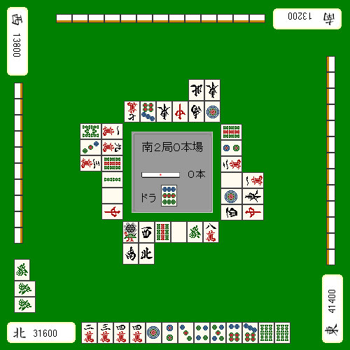
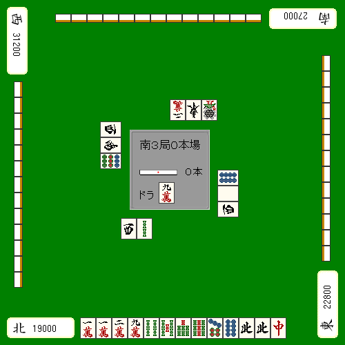
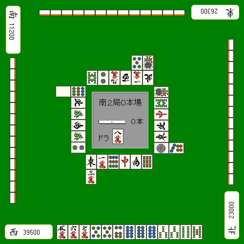

# 情境与手工 (3)

点棒状況に合わせた手作りを考えてみます。
 
マイナスしているときは打点、
 
プラスのときはスピードを重視するのが基本的な考え方です。

## 追逐击球点

即使你追求打点，也不要只是强行瞄准角色类型。
 
我们和牌牌顶尖队伍之间的差距正在拉大。

- 门森恢复
- 宝藏瓦用户
- 混一色

这三点是获得高分的关键。

**示例1**

获得高打点的最短方法是直立。
 
例1有一定积分，但目前正在与下家争夺榜首。

如果您使用  被Uieya砍下来，你会很辛苦，但你和牌牌顶尖人物之间的差距根本不会缩小。这些都是门森应该坚持恢复的动作和牌牌情况。

ライバルのトップ目が親番の時に、クイタンなどで軽く流してしまうのは「状況が理解できていない」といえるでしょう。

### セオリー

基本的事情是瞄准父母的打击并创建打点。

**示例2**

仕掛けて打点を作るのであれば、宝牌を強引に使うのもひとつの手です。
 
例２のようにラス目で打点が欲しい状況なら

这个
我认为 chirp  并用吟唱者设置它。
 
目的是利用漂浮的宝物牌获得“昙塔三色北宝堆1”或“昙塔北宝堆2”。

虽然是个牵强的噱头，但总比跟Menzen走要好。
 
我认为你能够达到曼坎的概率很大。

**示例3**
自摸宝牌

我想有很多人在最后一步就失去了平衡感。

无论您需要多少个点，示例 3 都将是最佳选择。
 
如果你不想被便宜抓住，就别哭。

メンゼン立直なら宝牌を切っても出て５２００、ツモって満貫は保証されます。

 不建议对切割后的宝物砖进行固定。

## 追逐速度

**示例4**
自摸宝牌

 を切って平和牌牌イー向听牌牌に取るのが通常の打ち方です。
 
しかし南３局のトップ目など、どうしても局を進めたい場面であれば
 
宝牌对子落としが妙手となります。

当然，除了切割宝牌之外，

就拿口吃来说吧。

**示例5**

山顶最大的挑战是第二个Oyaban。
 
永远不要让他们呆在一起。
 
通常，你应该使用 Menzen 来尝试重新站起来并粉碎你的老板。

因此，这个  是一个可以做成最终布局的移动。

听牌牌选项似乎很容易出现。听牌牌会更好吗？

