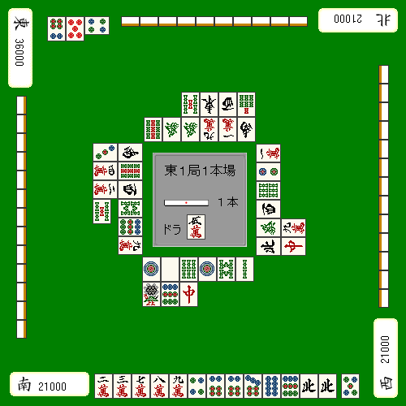
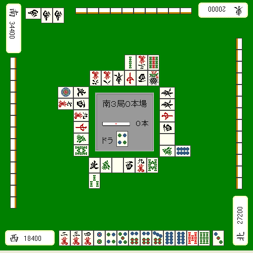
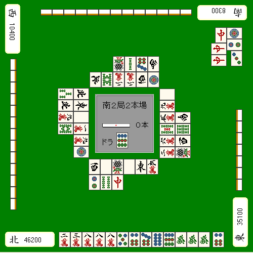

# 局况与立直判断

前面讲过，听牌以后大多数情况下都应该立直。  
但也有一些局面，平时会立直的牌这里反而该默听；或者平时会默听的牌，这里却必须立直。

这一页讲的就是这些“要看局况改判断”的场景。

## 山越字牌宝牌单骑

比如例 1 这样，七对子已经听牌：

**例1**  
 自摸 宝牌

正常当然是取宝牌单骑。  
但假设这时，上家刚刚打出一张宝牌 。

这种场面里，优秀的打法往往不是马上立直，而是先默听 1 到 2 巡。

理由在于：

1. 刚才没人碰，说明下家或对家就算有人持有，也大概率只是一张。
2. 到了中盘以后，字牌宝牌握在手里经常会让牌型变窄，很容易出现“其实很想切，但只能先抱着”的人。

所以如果这时有人再打出宝牌，就能立刻荣和。  
这种“等别人来顺打”的机会，本身就是默听的价值。

当然，如果过了 1 到 2 巡还是没人打宝牌，就说明要么大家根本不是会切宝牌的牌型，要么压根没人持有。  
这时继续默听也行，改成立直赌自摸也可以。

## 立直现物待

**例2**  

像这种局面，更好的打法通常是默听，期待  出和；如果之后摸到立直家的危险牌，就立刻撤退。

这种手不适合深追。

因为就算立直了，打点也不高；一旦打进亲家，甚至可能是致命伤。  
如果只是现物待想追立直，那至少也该满足：

1. 好型
2. 两番以上

否则一般不值得。

## 南场的立直判断

到了南场，比分状况会强烈影响立直判断。

**例3**  

南场自己是末位，这是一手明显的胜负牌。  
这种牌就该秒立直。

确实，也能找到默听的理由，比如：

1. 这个待张看起来不太好出
2. 默听已经有满贯

但看点棒就知道，这里你真正需要的不是满贯，而是**跳满自摸**。  
而且即使立直，亲家也很可能会继续战斗；下家根据手牌情况，也未必不会点进来。

就算所有人都弃和，也必须赌  的自摸。

这种局面，不能只看“眼前默听也能和”，而是要看“哪种结果才真的满足分数需求”。

---

**例4**  

南 2 局自己暂时第一，但下家正在猛追。  
而且从河来看，下家几乎已经明示在做筒子一色。

场上还能看到 4 张 ，因此  是所谓的“绝听”。

这里当然要切 ，但不应该立直，而应该克制住。

原因是：

1. 如果你立直，正在争末位的两家很可能直接彻底弃和，导致  完全被封住。
2. 这一局最重要的不是做大，而是尽快流掉这个亲番。
3. 这里并不是非要满贯，3200 点就已经足够成为决定性一击。

另外，虽然概率不高，但就算之后被迫摸来 ，也还可以改打  回头。

例如：

 自摸

总之，到了南场以后，立直判断必须带着“名次意识”来做。  
下一页会继续进入更看重局况判断的终局战术。
