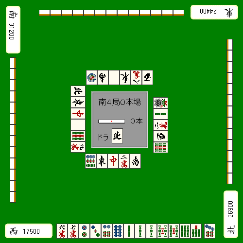
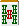
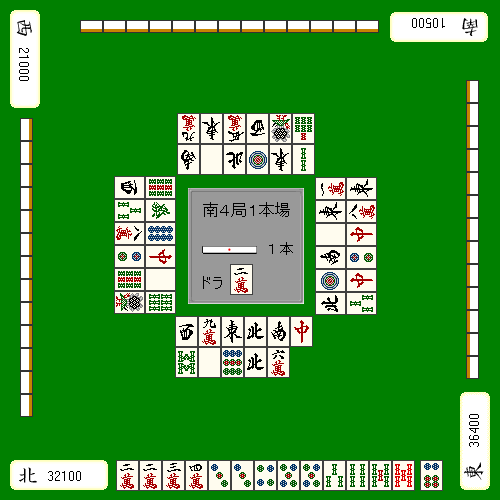
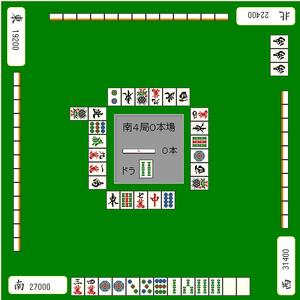

# 最终策略（1）

最后一场比赛是最考验你的本地判断力的一场比赛。
 
首先，必须准确理解“需要获得多少积分才能获胜”。

## 自摸 减少了分差

如果你是父母，你可以说“哦，你在滚动吗？”，但对于孩子来说，你需要在获胜后立即知道你是否在滚动。

特别是由于 1300/2600 是常见条件，
 
最好记住父母和牌孩子之间可以减少的分差。

另外，重要的是如果你得到了曼坎，分差将会减少。

“如果我们能够与Mankan 自摸达到分差，我们的目标就是逆转。”

最好将这一点作为理论牢记在心。
 
满贯直击和牌破月都不是你能轻易瞄准的。
 
“曼苏莫条件”被认为是逆转的现实边界。

相反，**最后一场比赛将在Man自摸范围内（另一方面，如果你在顶部，你将在Man自摸范围之外）**
 
关键是要这样打。

## 逆向手工

不用太担心 因为已经是大结局了

如果您面临逆转，请不要浪费机会。

**示例1**

如果情况平坦，我认为剪切 ，强调速度。
 
然而，如果目前是最后一场比赛，并且光津茂位于第二位，羽光将成为第一名。

没有选择，只能输入 。有足够的材料可供瞄准。

然而，这并不一定意味着这三种颜色都会变好。
 
如果变成只有9块的数位板，
 
可以说，击中眼前右边，希望单枪匹马，红宝牌，或者乌拉宝牌，都是现实的。

**示例2**

这是一个简单的问题。
 
他和牌顶尖的差距，只有4300分。
 
一根竖条，一个流程，无论在哪里拿到3900分都是逆转。

因此，削去宝瓦，
 
如果你得到一块会唱歌的牌，你就可以唱歌并拿走牌。

 
这不是你瞄准 Tampin Sanshoku Epeko 的场景。

## 瓦片判断

如果您在游戏中处于领先地位，则只需关注速度即可。
 
任何东西都可以稍后添加。

**示例3**
 退出

例如，假设您在比赛结束时排名第二，并且想要完成比赛。

在这种情况下，无论外表如何，你都应该去和牌。

因此，如果  从上屋出来，是方砖的一招。

**示例4**

比赛结束时，他与领先者的差距为4400分。
 
条件是1000/2000 自摸或3900直接命中。

因此，主题是 3,900 件手工制品，或者更具体地说，是 Hakubao 牌 2。

然后，你可以想到这个  作为重要的牌。
 
在所有人都参与的最终游戏中，即使你试图通过添加获胜牌来设置它，它被阻止的可能性也很小。

我也正在筹建下议院，所以时间不多了。
 
虽然3900日元还不够，

意外元素，例如红色拉扯或玩具男孩或家长拿出一根站立的棍子
不应掉以轻心。

我认为在这里做出决定是个好主意。

