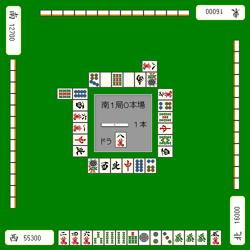

# 麻雀是什么？

在本网站中，我以麻将理论为核心，公开我自己的麻将战术。
内容尽量重视实战性，使用丰富的牌画尽可能简单地解释。
目标是系统化麻将理论（麻将理论）。

我将假设您了解麻将的规则和牌牌基本术语来继续，所以
不知道的人请在<a href="http://www2.odn.ne.jp/~cbm15900/">初学者的麻将讲座</a>中学习后再来更安全。

在开始麻将讲座之前，我想在这个页面上写下我对麻将的看法。

## 麻将与运气气气

「麻将中是否存在运气气气或流势」

这是近年来一直讨论的话题。
让我明确我的想法。

运气气气对麻将来说很重要，这是不言而喻的。
从长远来看，运气气气可能好可能坏，但最终是实力的较量，
但是不可能连续打1000次半荘。

即使聚集一次，最多也就20次左右吧。
麻将的胜负等，大部分取决于当天的运气气气。
当然麻将也有实力的因素，
但是打了几百几千场比赛后，终于会得到与实力相匹配的结果。
从现实的角度来看，我不得不说还是「运气气气」。

那么，到底是否存在「运气气气」或「流势」这样的东西呢？

我不否认它的存在。
如果是2-3次左右，自然会出现吉凶的偏向。
配牌和牌牌展开可能会很顺利。
手牌不好，什么都做不到，最后吃了末位。
有时好的状态和牌牌坏的状态持续，有时突然改变。
但好像没有规律。
对于运气气气和牌牌流势制定战术是否真的有效，我很怀疑。

那么，这是一个例题。

两连胜后的第三场比赛，这次半荘也和牌牌了6000全，遥遥领先。
状态极好时，亲家立直了。

顺势而动，和牌牌这样打的话，你一定是败组。

「因为运气气气好所以不放获胜牌」

「如果在这里弃和牌牌就会失去气势」

这些与其说是神秘学，不如说只是自己编造坚持（固执）的理由。
常识性思考，在这个点数状况下没有胜负的理由。

的暗刻舍弃是正解。

即使是神秘主义派的人
也有选择「如果在这里振込（放炮）就会失去好不容易的流势」而弃和牌牌的人，
但这有多大说服力呢？

流势这种东西，不知道会持续多久。
到目前为止运气气气好，并不意味着下次也会有好的结果。
即使骰子连续三个1，
下一个是1的概率也只有1/6。
预测运气气气和牌牌流势是不可能的，
更何况人为地招来运气气气只是梦幻故事。
无论展示了多么精彩的打法，
麻将不会那么甜，幸福就会随之而来。

麻将是由运气气气（偶然）支配大部分的赌博游戏，
实力很难体现。
即使努力提升实力，
如果没有运气气气，也会轻易输给明显低位的对手，这就是麻将。

运气气气·运气气气·流势——全都是神决定的。
没有运气气气，流势不好……对此你无能为力。请放弃。

## 麻将的目的

我确信正在浏览这个网站的人
大多数可能会想：「我想在麻将上变强」。
具体来说

- 提高麻将的收支
- 提高麻将游戏的评分
- 在麻将游戏中获得称号

等，我认为大家带着这样的目标在打麻将。

然而，这不应该是麻将的唯一目的。
有些人「坚持要拿到第一名」，比起成绩更重视达到顶峰。
有些人重视「提高包括役满在内的高点和牌牌牌」。

例如：　　自摸　　碰

例如，不和牌牌这手牌，切瞄准大三元也是一种思考方式。
麻将中有损得考量的正解，但怎么打完全是打手的自由。
没有规则。

对麻将的思考方式因人而异。
经常有人批评末位确定（4位确定）的和牌牌牌等，
但请不要成为将自己的价值观强加于人的傲慢打手。

在麻将中应该被指责的
只是妨碍游戏顺利进行的行为（作弊、延迟行为）。

在这个网站中，我以「提高麻将成绩」为目的写作，但
并不是主张这里介绍的打法是「独一无二的正解」。
为了不产生误解，我先声明一下。

从下一页开始是麻将讲座。
