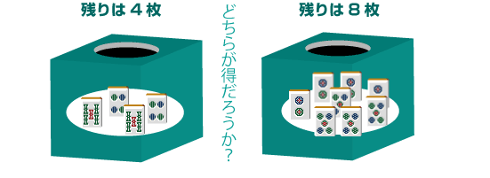

# 麻将与概率

说到麻将的手牌（手作り），
有些人可能认为这是完成什么役的问题，但是
我认为这与麻将的本质脱节。

手牌的本质是「四面子·一雀头」这样的形状。
如果在一局麻将中看，
四人中谁会最先完成「四面子一雀头」？这是一场比赛的游戏。

当然，最后会根据你的得分来评价你，但是
考虑到现在麻将游戏的性质，宝牌较多（包括红宝牌），即使没有役种也能获得高分。
毕竟，本质不是役种而是形式。

由于只有先完成牌型的人才能获得得分，
速度是不可避免的要求。

那么怎样才能快速完成呢？
其背后的思考是搭子理论和牌牌概率。

## 示例1：应该切掉哪张？

　碰　　自摸

让我们考虑一个最简单的例子。
在示例1中，三面听和牌牌雀头已经完成，只需要再制作一个面子即可。

当你切的时候听牌如果它来了（如果它出来了），那就是和牌

当你切的时候如果它来了（如果它出来了），那就是和牌。

很明显应该切掉哪张，这样更容易完成。

## 示例2：应该切掉哪张？

　碰　　自摸

可以作为和牌的获胜牌（仅多一张牌就变成和牌的状态）是和。

当你切的时候，听牌

当你切的时候，听这将是两面听。

由于两者都有两种类型，因此并不意味着它们在听牌方面是相同的。

我自己用了2个，所以还剩下4个。

剩下 8 张牌（仅从我的手牌来看）。

如果要摸牌，最好是获胜牌最多。
当然，如果你听的听牌数量多的话，获胜的概率会更高。「选择要切的牌，这样你就有机会赢得彩票。」这是手牌制作的基本理念。

## 总结/理论

麻将是一款即使你尽了最大努力也常常会失败的游戏。
不要为暂时的结果感到兴奋和和牌的悲伤，
从长远来看，决定哪一个更好。
