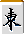
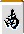

# 柒牌（听牌牌牌）和牌牌象棋（象棋）

通过 麻将 的手工工艺品学习重要概念。
重要的是要了解手中牌的搭子，而不是手的类型。

## 麻将的和牌牌形式

不用说，《Asho》是一款以完成 Waryo Kata 为目标的游戏。
这种获胜形式大致可以分为三种模式。

(1) 完成石面子和牌牌市子
(2) 完成七个孩子
(3) 完成国士无双

(2)和牌牌(3)是特殊形式，基本形式是(1)的四面体形式。
有两种类型的面孔：Kiko (Coates) 和牌牌 Junko (Schunz)。

[纯子]...一组 3 个连续的图块

[纪子]...一组 3 个相同的瓷砖

因此，考虑瓷砖成分的麻将获胜形式如下。

**1. 石面子一帕祖**

1-a 四顺子

1-b 三顺子一喜子

1-c 二纯子 Nikoko

一维一顺子 Mikko

1-e 四块肉排

**2. 七个孩子（吃对子）**

**3.国士无双**

制作这些 Waryo kata 的难易程度存在差异。
当然，最难的还是国士无双，
作为回报，他们获得最高分，Yakuman。

严格来说，门氏有一组 4 张相同的牌，但是
这里与 Tokiko 没有区别。

## 什么是听牌牌扌？

只需多一块即可完成的搭子称为听牌牌牌。
如果有角色，你就可以做到。

[示例1]

蚊子这是一种让你生气的形式。

作为雀士，除非获胜，否则您不会获得积分。 （别人的chonbo除外）
另外，如果是Menzen（没有牌打出的状态），则可以应用恢复。
所以，尽快拿到柒牌很重要。

## 方向数（方向数）

[示例2]我们距离最后阶段仅一步之遥。如果您抽中 ，您将获得听牌牌牌。这样，多抽一张有效牌，你就成为了牌。成为“听牌牌牌”的接受（在这种情况下）被称为“听牌牌牌机会”。赢得牌的机会越大，击中牌就越容易，
也算是优秀的易象棋了。[实施例3]例3为易象棋，其受理张数较多，共13类42张。

示例 2 有 12 张 3 种类型的牌，因此相差近 4 倍。这样一来，就算你一口说出“易向奇”，
瓷砖的组合对于游戏的容易程度有很大的影响。到达最终方块所需的最少移动次数称为“移动次数”。
听牌牌方向数为 1 的图块为“Ikko”
方向数为2的手称为“梁闻”（梁象棋）。
其次是三湘旗和牌牌苏湘旗。

这是一个微不足道的事实，但马将中距离听牌牌牌最远的就是六子町。
[实施例4]
例4是六子町的例子，即使是最短的七子牌也需要六步。
方向号码是到达Agari需要多长时间的指南，是一种非常重要的思维方式。
能够直观地了解你的手当前正在做什么象棋。最起码，应该把易向奇和牌牌梁向奇区分开来。 
减少交通量
如果你的手是两象棋，则瞄准一象棋；如果是一象棋，则瞄准七牌；如果你的手是七牌，则瞄准顶部。
津莫
例如，如果你因为这只手位于边缘或漂浮而将其砍断，那么这只手将保持两相气。
为了晋级易象奇，咱们斩卡吧。

Ma-Sho 是一款游戏，您需要按照图中所示的步骤进行操作，直到到达终点。
中间的一步绝对不能跳过。
根据手牌的不同，有时最好不要减少转牌次数，
基本上，你应该考虑玩牌来减少玩家数量。

