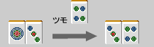

# Menko (Menshi) 和牌牌 Toshi (Toko)

## 科茨（Kokuko）和牌牌舒茨（Junko）

麻将的Waryo Kata需要四张脸，
有两种类型的面孔：（Koko）Coates 和牌牌（Junko）Schuntz。

[纯子]...一组 3 个连续的图块

[纪子]...一组 3 个相同的瓷砖

基本上，Schunz 比 Coates 更容易制作。
马雀士中只有 4 张相同的牌。
由于您需要收集其中三件，因此外套的制作自然很困难。

然而，在瓷砖上，
你只能在上议院唱歌，但你可以在任何地方演奏一辉。
如果它发出尖叫声，外套就更容易制作了。
（不过，这并不比 Schuntz 更容易做到）

能自行收集三层外套而不发出声音的外套称为“anko”。
由于雕刻难度较大，有三刻和牌牌四刻可供选择。
这些类型的角色很难实现。

毕竟，正雄的脸应该是以顺茨为原型的。

### 总结/理论

马修有两个侧面，科茨和牌牌顺茨。
Schunz 比 Coats 更容易制作，所以
应该是在 Schunz 的基础上手工制作的。

## 什么是东光？

一组两个圆盘可以通过添加一个圆盘制成 Schunz，称为 toshi。
toshi 共有三种类型：

搭子
姓名
有效卡
有效卡张数

亨巴里 (Penchan)
　
4 件

　张昌
　
4 件

两侧（连门）
　
8 件

从这张表中可以看出，凉门是最受欢迎的形式，接受程度是碰禅和牌牌楚禅的两倍。是。

“做凉门”是手工烹饪的基础。

## penchan 和牌牌 kuchan 的比较

现在，我们来比较一下 Penchan 和牌牌 Kuchan，乍一看似乎没有什么区别。
转手梁门就会有不同的结果。

彭昌为了使其双面→你需要提出来。

他和牌牌朝志改变两个动作的可能性是相当渺茫的。是。
朋禅很难想象会变成梁门。

杠陈如果是这样，如果你拉，它会立即改变到两侧。

如果你改变一个动作，你就可以期待一些东西。

而且如果你是这样的粉丝，无论拉哪一个，两边都会发生变化。考虑到梁门的变化，强禅比彭禅更有优势。

而且，论角色类型，彭禅奇绝对是无敌的。Penchan 是一种糟糕的形式理解这一点就好了。

### 总结/理论

斗士分为三种：“penchan”、“barchan”、“liangmen”。

梁门 >> 盆禅 >> 盆禅

价值上有差异。
创建梁门是武将的基础之一。

