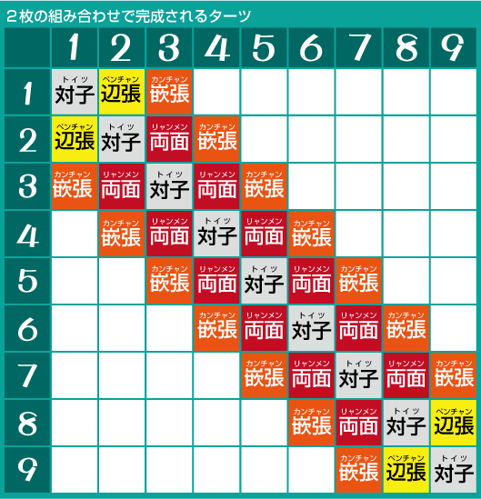

# 数字瓷砖和字母瓷砖

阿苏瓷砖有 34 种。
让我们考虑一下每个图块具有的功能。

## 麻砖的分类

一般瓷砖可以如下表分类。

**・几块瓷砖**

[男士]

[图钉]

[剑]

**・角色牌**

【风瓦】【三元砖】

数字牌 (supai) 分为三种类型，分别代表从 1 到 9 的数字：人牌、别针牌和剑牌。
亮剑中有一个角色是全绿的，但是
这三种类型可以认为具有完全相同的值。
不过，成为宝藏牌的颜色整体来说价值稍高一些。
有一种麻将馆，红色的宝牌只用于别针。
在这种情况下，图钉将是最强的颜色。
这方面没必要特别留意。

共有 7 个字符牌，分为两种类型：风牌和三元牌。

三元瓷砖数值基本一致（因为全绿瓷砖出镜率极低）
您需要小心，因为风砖可能是也可能不是手砖，具体取决于您坐在哪里。

## 关于角色图块

三元牌是非常有用的牌，只需排列 3 张即可作为获胜组合。
如果您最终获得了宝藏图块，请确保不要犯任何错误。
展示牌和宝物牌按照“白→发→中”的顺序呈循环关系。

风牌可能会也可能不会成为角色牌。

(1)场地瓷砖是屋久瓦
东至东、南至南、西至西、北至北。
通常，比赛都是针对东南或东方进行的，所以西方和北方很少成为比赛的风向。

(2)Monkaze 瓷砖是 Yaku 瓷砖
东屋以东，南屋以南，西屋以西，北屋以北。

(3)其他风瓦、客風牌（オタカゼハイ）不是角色图块。

东边是东波父母，南边是南波家。

不能用作手板的大风，是最不值钱的瓷砖。
如果发牌中只有一张牌，那么很有可能在第一次玩时就将牌丢弃。

## 关于数字瓷砖

有从 1 到 9 的几块图块，
每个人的修脸能力都有很大差异。
我想如果你看看下表就很清楚了。

您可以使用 3 到 7 四种类型的瓷砖来制作 toshi。
梁门有两种，玉蟾也有两种。

您可以使用 3 到 7 四种类型的瓷砖来制作 toshi。
梁门有两种，玉蟾也有两种。

2 和 8 的有效牌较少，有 3 种类型，
而且，梁门只能分别制造3种和7种一种。只有1和9两种接受类型。
而且，也只是Penchan、Tsugichan等愚蠢的形态。因此，阿育王的牌数排列如下：A 级 3 到 7 之间存在细微差别，
关注差异只是自我满足。
对此没有必要特别在意。
最好了解内侧瓷砖比边缘瓷砖更坚固。边缘瓷砖之所以薄弱是因为
即使你可以用麻生牌“1、2、3”和“3、4、5”来挽回面子
根本原因是说“8、9、1”之类的话无法挽回面子。Menko 由 3 到 7 块瓷砖组成。
手工制作的诀窍是充分利用里面的瓷砖来营造幽默感。理论/总结朝日的牌数，做脸的难易程度有很大差异，
　
3～7＜2・8＞11・9

这些瓷砖的价值约为 。

