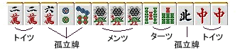
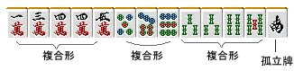

# 基本形与复合形

到这里为止，麻将里最基本的牌形已经都讲过了。

1. 面子（刻子、顺子、杠子）
2. 搭子（两面、嵌张、边张）
3. 对子
4. 孤立牌

**麻将的手牌，最终都可以拆分为这 4 类部件。**

先看具体例子。

**例1**

假设起手拿到这样一副牌：

它就可以像图里那样，拆分成若干个基本部件。

把手牌分解成这种“部件”去理解，非常重要。
为了避免一些简单失误，**初学阶段最好先把牌理清楚、分清结构再打。**

**例2**

那么例 2 呢？
这手里的万子、饼子、索子，全部都属于**复合形**。

如果你硬要继续把它们拆回基本形，就会开始出现“怎么拆都说得通”的问题。

比如万子部分：

（搭子） + （对子） + 

可以这样理解。

但你也可以把它看成：

（面子） +  + 

问题不在于哪一种拆法“正确”，而在于这种牌形本来就不该被强行拆成单一答案。

我强烈建议把它理解成：

**复合形，就作为复合形去把握。**

麻将牌一旦组合起来，就会产生比“基本形相加”更复杂的功能。
如果想不遗漏这些功能，最好的办法就是把各种常见复合形的性质，直接当成知识记住。

复合形的模式其实是无限多的，不可能全部背完。
但随着你打牌经验增加，对牌形的感觉会越来越强。到那时候，即使碰到少见的复合形，也能较自然地应对。

接下来几页，就会开始介绍一些基础且常见的复合形。

### 理论 / 总结

手牌由“面子、搭子、对子、孤立牌”这 4 类部件构成。
如果 2 种以上的部件发生重叠或缠绕，就会形成复合形，而复合形会拥有基本形所没有的性质。
理解这些复合形各自的特点，是提升牌理判断力的重要基础。
