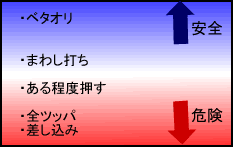

# 防御基础知识

麻将军的理想防御是仅阻止被击中的方块并切断其他所有方块。但实际上，这是不可能的。当然，你可以通过阅读来缩小对手的命中范围，但现实是你命中的概率不会低于 30%。

防守时，了解对手是否有琬牌很重要。

这是不言而喻的，但如果你的对手没有笔，无论你砍什么，你都不会滚动。

所以，防御主要是应对恢复。

试图康复的人告诉我“我是负责人。”

它不可能那么容易转移。

## 防守和进攻策略

如下图所示，策略大致可分为五种。

如果你打算放弃汇款，甚至放弃Agari，你自然会采取“整合”策略。如果您要去阿加里，这是一个“全力以赴的计划”。

我列出了五个，

如果您不习惯，“Yawa”和“Zentsupa”两个选项就足够了。

插头仅在特殊情况下使用。

## 什么是岩瓦？

这是一种抛弃自己的琼脂而专注于防守的风格。

  防御的基础就是这个津和。

具体的去污方法将在后面介绍。

## 头盔瓦

打球的方法是避免转会，但要尽可能地争取。

我认为这是相当困难的，因为它需要阅读和有限的手工制作。

有竞技麻将之类的大规则，没有处罚。

对于牌型较少的三人麻将有效，但是

充气麻一般用红不是很有效。

## 让我们专注于防守

初学者经常被告知要先学习放弃和。

这是因为弃和是一项易于学习且与成绩直接相关的技能。
  许多初学者和中级玩家过于激进。

在朝日，处于这样的境地并不是一件很愉快的事情。

不过，想要成为一名武将变得更强，就必须加强这一领域。

旨在通过提高防御力加入胜利者的行列。

