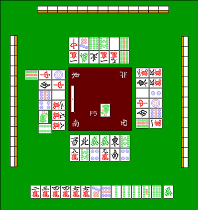

# 安全牌

例如，对于本次恢复

什么牌就算切了也赢不了？

就furiten而言，一般规则是你不能赚到很多钱。

对手丢弃的所有牌都是安全的。

在本例中： src="../hai/man9.gif" style="display:inline;vertical-align:middle; margin:0 1px;" width="24" height="34"/> 与此相对应。

另外，站立后，如果您错过了一次罗恩图块，您将无法再次获得罗恩图块。

トイメンが通している  、下家が通している   もロンされない牌です。

这样，由于禁止自由玩的规则，你可以选择一个显然不会玩的牌。

**它被称为“现物”**。

現物以外に、１００％安全な牌がありますね。

它是  。

场上已经有 3 张牌，所以没有商七七或单七七。

而且，由于没有国师无双，所以它是绝对安全的牌，永远不会被击败。

有四种完全安全的瓷砖：

- 其他三人均切一张牌（三人实际的牌）
- Kamie刚刚切好的瓷砖（这也是三人的实际物品）
- 国士無双听牌がありえないときの、場に４枚目の字牌
- 完全没有机会

最後に関しては「壁牌」で解説しています。

在此示例中，有足够的安全图块，如果您愿意，您可以轻松避免进行转移。然而，并不总是存在安全的瓷砖。

这就是为什么“吊砖”和“墙砖”变得重要。

