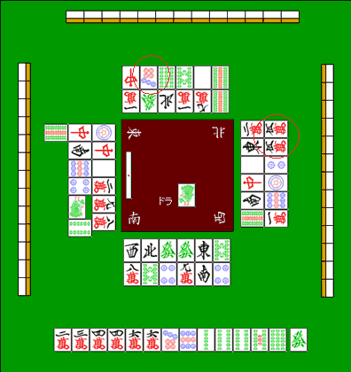

# 筋牌について(1)

立直がかかったとき、最も警戒するべきなのは**リャンメン听牌牌**です。

除非你的对手是刚学马手的初学者，

如果改变双方都改变，我会接受。

等待手柄chan、penchan、shabo等有利的变化。

即使你放弃，他们也可能无法康复。

だから立直の听牌牌はリャンメンが多い。

だいたい**立直の２／３がリャンメン听牌牌**というデータがあります。

避免转账到梁门旗的理论是“苏吉瓦”

## 6块肌肉块

我们来实际看看那个梁门旗。

・・・・**１－４听牌牌**

・・・・**２－５听牌牌**

・・・・**３－６听牌牌**

・・・・**4－7听牌牌**

・・・・**5－8听牌牌**

・・・・**6－9听牌牌**

这六个就是一切。这六点一定要记住。

你应该能够很快记住它，因为每个听牌牌都是三元组。

## 三组

当我看到上面的六个大写字母时

我注意到 Pang 穿在 1-4 和牌牌 4-7、2-5 和牌牌 5-8、3-6 和牌牌 6-9 上。

而且，当我想到三门坡时，

...**1-4-7 听牌牌**

・・・**2-5-8听牌牌**

...**3-6-9 听牌牌**

それぞれの听牌牌が合わさったものが三面听牌牌だと分かります。

というわけで、６つの筋牌は３つにグループ分けできます。

**
1-4-7（易洙）
2-5-8（连和牌牌帕）
3-6-9（萨布罗楚）
**

六个肌肉块和牌牌三个分组非常重要。

让我们知道这是雀士的常识。

## 从肌肉块中你可以看出什么

(1) 如果您已打出获胜牌（furiten），则您不能获胜。

（2）马将的梁门旗只有6个（1-4、2-5、3-6、4-7、5-8、6-9）。

从这两个中，你可以看出哪些牌是双面的，永远不会是罗恩。

再次考虑这个例子。

玩具人是 ，Shimoie 是  我在启动后立即通过它

这是一块“素吉瓷砖”，因此它是一块切割瓷砖。

恢复后的 Azuma 家族有 ，所以  没有两条边。

 剪了至少不会两边都转移

 は、 ２つの牌から導ける「筋牌」です。

 是  src="../hai/man4.gif" style="display:inline;vertical-align:middle;margin:0 1px;" width="24" height="34"/> 和牌牌 可以是两种类型的双面长瓷砖，

Azuma 家族是  由于它也被切割，因此无论哪种情况它都将是Furiten。

したがって はわりあい安全な牌と言えます。 

