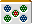

# 关于苏吉砖（2）

我们将进一步解释阿苏族中最重要的概念之一——苏吉瓷砖。

## 遠い筋牌？

这是初学者中常见的误解。

例如

有了这次的康复
正在被丢弃，所以

是一块肌肉砖。
因为没有梁门气，所以比较安全一些。
不过，即使道路畅通，也不能说是安全的。
有时我看到人们在切割瓷砖时说：“远了！”，但这没有任何意义。

然而，尽管“和”相同，但风险程度却有所不同。
 双方都有可能都是如此。
 既然两边都被否定了，可以说还是比较好的。
我已经把肌肉块放在桌子上了，请检查一下。

废弃瓷砖
肌肉砖

4
1 和 7

5
2 和 5

6
3和9

1 和 7
4

2 和 8
5

3和9
6

## より安全な筋牌

<丢弃棋子以帮助对手恢复>

宝藏瓷砖

让我们直接思考一下。宝藏图块为 。

自分の手が例１であったとします。

**示例1**

Tsumo

 穿过，所以  和  是主图块。

我应该放弃哪一个？

- 是正确的
单人骑手
和某种香槟或
- 是正确的
单人骑手
 和某种香槟

很明显  更安全，因为不存在 penchan 或 kochan 的可能性。
所以我们就在这里剪掉它。

有些人可能想知道是否有单骑这样的事情。

像这样的复合形式是很有可能的。

### 理论

老頭牌は杠チャン・ペンチャンがないので他の数牌よりも安全！

＜相手の立直の捨て牌＞

宝牌

図２

ツモ

次に自分の手が図２であったとします。
とが筋牌です。

が当たるのは
単騎
と何かのシャン碰

が当たるのは
単騎
と何かのシャン碰

但是， 4 ** 可见（包括宝藏图块显示图块）**，所以
Pin 是不可能的。

另一方面，宝藏图块是 ，所以杠看起来是可以的。

 将被剪切并恢复。

等等也是可能的。

 は「筋牌で安全」どころか、**バリバリの危険牌**ですね。

从图 2 中，剪出 。

### 理论

宝牌そばは、筋牌でも危険！
筋牌ひっかけ立直も多い

