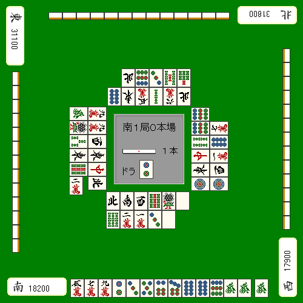
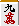
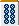

# 壁牌

除了筋以外，寻找更安全牌的另一种方法就是“壁”。

## 无机会

假设对手的待张是到的两面待。

那就表示，对手手里至少要有 1 张和 1 张。

既然如此，当场上已经看得到 4 张或 4 张时，对手就不可能是到的两面待。

原因很简单：同一张麻将牌总共只有 4 枚。

所以，会变得相当安全。

但要注意，并不能说安全。

因为到的两面待依然完全可能存在。

| 4 张都已见的牌 | 通过“壁”相对安全的牌 |
| --- | --- |
| 1 | 无 |
| 2 | 1 |
| 3 | 1、2 |
| 4 | 2、3 |
| 5 | 3、7 |
| 6 | 7、8 |
| 7 | 8、9 |
| 8 | 9 |
| 9 | 无 |

## 一次机会

如果某张牌已经见到 3 张，就叫做“一次机会”。

因为最后剩下的那 1 张，有可能正好在立直者手里，所以它和“无机会”不同，仍然有放进两面待的可能。

要记住：

- 序盘时，一次机会还能参考
- 终盘时，一次机会几乎不可靠

如果在早巡就已经看到 3 张，那么最后 1 张埋在牌山里的概率并不低，这时一次机会的可信度还算可以。

但随着局面进入后半段，这种可能就会越来越低。

还有一种情况。比如立直者自己先打过。

由于立直者的现物本来就更容易在场上出现，一次机会也就更容易被“人为制造”出来。

尤其当另外三家都在弃和，但最后那张迟迟不见的时候，它很可能就在立直者手里。

另外，明明形成了壁，但一直不出现时，也要怀疑是不是双碰待。这一点其实无机会时也一样。

总之，一次机会并不是特别靠得住的依据。

### 理论

一次机会在前半盘可以参考，但到了终盘不要轻信。

## 双重一次机会

一次机会还有进一步的应用。

比如两张牌都已经各自看到 3 张时，对手同时持有它们来做搭子的概率就会非常低。

这种情况叫做“双重一次机会”，这时就会变得相当安全。

安全度大致是：

**无机会 > 双重一次机会 >> 一次机会**

## 实战中如何利用壁

下面实际来看一手：

这里切立直现物的当然也不差，但更好的选择是。

因为场上已经看见 4 张，所以不可能存在两面待。

而且在这手里，本身也是第 4 张，因此双碰待和单骑待也都不成立。

再加上这里不可能是国士无双，所以这张牌是 100% 会通过的。

---

---

原始日文页：<http://beginners.biz/mamori/mamori05.html>
