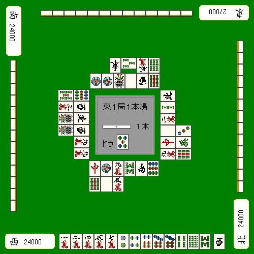

# 吸入步骤(1)

涉水有明确的程序，所以一定要仔细遵循说明。

应大幅减少转移。

## Yanwa的基本思想

安全度の高い牌から切っていく

这是原则。
 
我不在乎我的手是否会碎掉。

因此，“实物”、“完全安全的瓷砖”等3块瓷砖在现场

只要有这种事，我就砍掉。

从肯定通过的瓷砖上进行切割非常重要。

第一轮实际金额有可能增加，

有时其他家庭会动摇，而一个人会重新站起来。

即使有安全瓷砖，为什么要先把“看起来安全的瓷砖”切掉呢？

从防守的角度来看，这是一场“失败”。

## 实物优先

現物が複数ある場合にも、一応手順があります。

**将来の危険度の高い現物から切る**のが手順です。

例子

手はバラバラで、ここから親の立直に勝負するのは

日本がアメリカに戦争を挑むくらい無謀でしょう。

 是安全的图块。

 和牌牌  从任意一侧剪切都没有问题，但是从  是一个程序错误。

如果你在这里被追赶，你将没有安全瓷砖。

因为下家突然断线了，

事情很有可能从这里恢复过来。

不要犹豫，  这是你应该摆脱这种情况的情况。

### 理论

現物が複数あるときは、共通安全牌は温存しておく。

下次我会想想，如果安全牌不在我手里怎么办。

