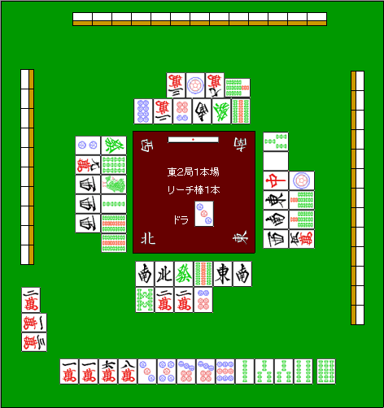

# 吸入步骤 (3)

それでは実際に、具体例で考えてみましょう。

**示例1**

看来双方的两名球员都会取得领先，所以我们的处境是，我们只能把我们的一切都奉献给那些站起来的人。

来自安全图块  →  →  → 

除非缺货，否则我可能会按这个顺序削减它们。

 几乎是完全安全的图块。

没机会了，既然是第三张牌，我就只能打七子的单马背了。

请小心，因为很容易错过已经玩过的牌。

接下来是肌肉块。

 和牌牌  均适用。

有可能是杠长骑，还有幺久的角色

请务必从 。

如果没有更多的条纹瓷砖，就无法停下来。

原因是  被提前切断，所以比较安全。

这是因为，如果你通过了一个，你就可以通过另一个。

