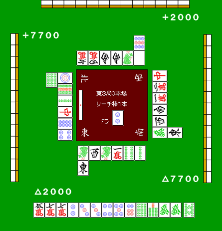

# 回转防守

回转防守是指：在尽量控制危险牌的同时，继续争取和牌或至少争取听牌。

常见于这两类局面：

1. 自己还没听牌，但不想直接完全弃和，仍想保留进攻机会。
2. 自己已经听牌，但继续硬拼明显不利，想先拆听再找更安全路线。

具体手段主要有四种：

1. 拆对子。
2. 拆搭子。
3. 拆暗刻。
4. 七对子转型。

## 对子落

这是回转防守最常用的方法，因为：

1. 一张能过，第二张通常也更容易过。
2. 不会大幅破坏手牌结构。

**例1**

这就是对子落很有效的典型局面。

若完全弃和，直接拆  过于可惜；
若一发硬押， 又太危险。

此时场上已见1枚的  做对子落是好手。
理想目标是转成门断平+宝牌1，反击立直。

## 搭子落

再看一个例子。

**例2**

没有立直压力时，这手通常会先拆饼子坎张（就算全押也大多这么打）。

若要回转防守，则先切 。
之后若能摸到 ，仍可立直。

即便是一向听，若摸到  等推进牌，
也可能继续打出相对安全的 。

相反，切  是坏手。
因为宝牌是 ，而后续可能要打的胜负牌  太危险。

搭子落回转时，最好保证“这组搭子的两张都相对安全”。

另外，若切  后手牌迟迟不进，反而不断摸危险牌，
就应立即转为完全弃和。

## 暗刻落

有时把一组安全牌三张整组拆掉，反而能在这3巡里摸到推进牌。
偶尔会从“纯防守”转回“可和牌局面”。

立直河：

手牌：
 自摸 宝牌

比如可先把  暗刻拆掉，
最终也有机会转成副露断幺和牌。

## 七对子转型

这种方式稳定性不高，但实战里并不少见：
一边现物弃和，一边切着切着突然就接近七对子听牌。

当手里有很难处理的牌（例如役牌宝牌），
又非常想“至少做到听牌”时，有时只能强行做单骑听。

这种时候，把七对子当作回转路线之一是合理的。

## 回转防守的注意点

回转防守只能在“适合回转”的局面使用。

1. 有些点数状况下，即便看起来还能和，也必须完全弃和。
2. 也有些局面即便手牌辛苦，仍必须正面胜负。

能回转的场景其实比想象中少。

请始终记住：防守的基本是完全弃和。
