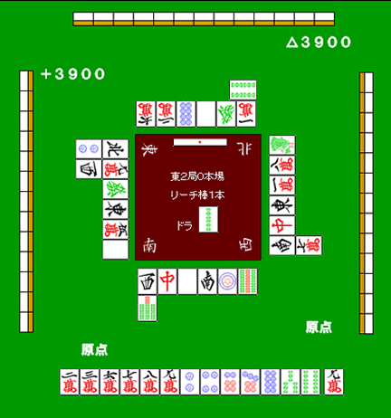
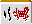

# 头盔瓦

这是一种以和牌牌或英镑牌为目标，同时抑制危险牌的游戏方式。

一般来说，当对手试图恢复时

- 虽然我不是皮条客，但我想以加里/皮帕为目标。
- 虽然我有据点，但是再这样打下去我就会吃亏，所以我想把据点攻破一次。

在这种情况下，您可以选择“mawash”。

具体的には、

**大年子子・大年子子・・安国大年子・七子〹**

の４つの方法があります。

## 对子落とし

这是 Kabuto 瓷砖的常用方法。

这是因为，如果你通过了一次，你可以再次通过，并且你手中的牌不会被破坏。

**例１**

这个例子是一个易于理解的例子，Kabuto 瓷砖是有效的。

弃和牌牌で を抜くには惜しい手ですし、一発で打つにははやや厳しい。

ここは場に１枚切れの  对子落としが好手でしょう。

メンタンピン宝牌１で追いかけ立直を打つのが理想です。

## 下车

让我们看一个具体的例子。

**示例2**

如果没有恢复，销钉将会掉落。 （即使有所有茶汤，听牌牌起来也是如此）

如果你想打字，这是  剪切。只需拉 你就会重新站起来。

即使在易象棋中，如果你画  等，肌肉平铺  砍下来好像也不错。

即使使用相同的头盔图块，  击球是一个糟糕的举动。

宝牌が  であるうえに、 勝負牌となる  が危険牌だからです。

搭子落としでまわす場合は、両方の牌が安全であることが望ましい。

不用说，如果  切后仍无任何进展，且玩家继续抽危险牌，应立即切换弃和牌牌。

## 暗雕

安全な牌を３枚アンコで落としているうちに、手が進むことがあります。

 ３巡の間に通せる牌が増えて、アガリに向えたりすることもたまにあります。

恢复

手板砖
 自摸宝牌

例如，如果您删除 ，

最后，你可能会对 Kuitan 感到沮丧。

## 七个孩子

这也是一种缺乏确定性的方法，但当你继续研究并切割实际的物品时，你可能会发现自己在不知不觉中已经交出了南智子。

如果你不会切割难用的瓷砖，比如宝牌，而你又很想把它拿到怀石上，那么你别无选择，只能**强行把它拿到怀石上**。

在这种时候，一种方法就是押注于日子。

## 头盔瓷砖的注意事项

兜牌は、「兜牌できる状況」でなければ使うべきではありません。

 点数状況によっては多少アガれそうな手でも完全に弃和牌牌するべきだったり、逆に多少苦しくても勝負に出るべきこともあります。

能够击中马瓦希的情况出人意料地有限。
 
 
 
不要忘记，防御的基础是“和牌牌”。

