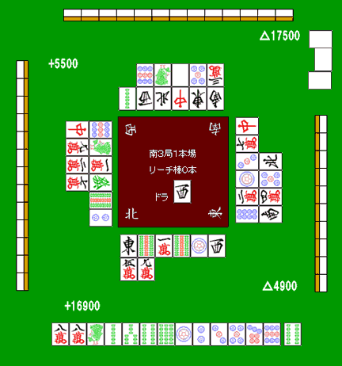
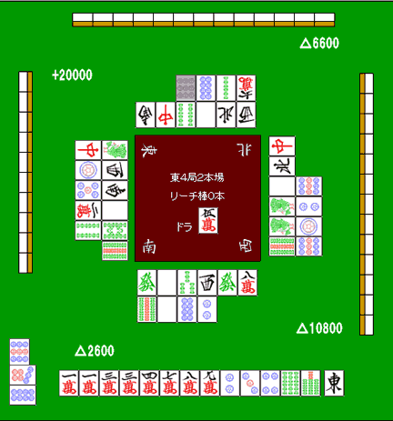
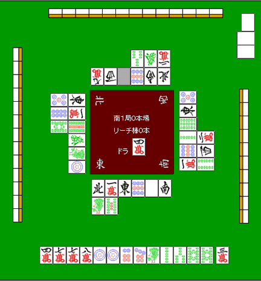

# 绞牌（2）

继续通过具体例子来看“绞牌”。

## 下家在做染手

需要“绞”的场合里，最常见的就是下家明显在做混一色。

这一例中，下家显然是在做索子一色手。

而且对手还是庄家，自己又是南场领先，条件全部叠在一起。虽然庄家大概还没听牌，但索子已经必须开始收紧。

自己的手虽然是一向听，但没有役，而且形也不够好。就算听牌了，也并不想把索子打出去。

当然，也可以打饼子维持一向听，但最好还是留着，以防之后被两家同时立直时还能有安全牌可用。

所以这里应该把按对子拆掉，整个手组都不要去打索子。

这是要狠狠干住对手，争取让庄家以未听落庄的局面。

## 后付字牌

庄家副露掉一个两面搭子之后，自己摸进了东。

这张牌，我认为必须坚决绞住。

庄家的副露形看起来不像混一色，也不像一气通贯、789 三色或全带幺这些路线。再看场上已经切过的役牌，基本只剩下“双东”这一种可能。

所以这里只能在两种选择中二选一：

- 切，摆出“只要能取到形式听就行，但绝不打出”的姿态
- 或者干脆开始彻底弃和

总之，绝不能“啪”地一下把甩出去。

不能切的牌，就是不能切。让现在第一的东家继续跑起来，局面会非常难受，所以这里要带着同归于尽的觉悟把它绞住。

## 攻守兼用的绞牌

　　自摸

如果只是在平场做一道“牌效率题”，大概会因为牌效率和摸后能做断幺九，而把对子拆掉。

从纯效率看，这是标准答案。

但如果场况是下面这样呢？

下家的副露到底有没有听牌、打点高不高，都看不太清楚。

可如果你切了，下家吃牌的概率并不低。

虽然就算被吃，自己的分数暂时不会立刻减少，但下家肯定会更接近和牌，自己失去亲番的可能性也会明显升高。

从整体收益来看，与其继续执着于这手带宝牌的牌去完成断幺九，不如优先照顾下家的仕挂路线。

所以这里切更好，因为这样下家应该没法动。  
