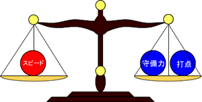
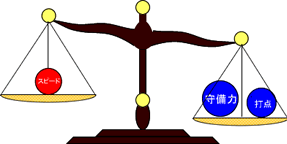
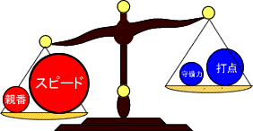

# 副露判断的基本

基于上一节，这一节讲“该鸣还是不该鸣”如何判断。

**例1**
 出 宝牌

东1局子家，3巡目对家打出 ，要不要碰？

核心不是“感觉”，而是比较鸣牌后的收益与代价。

1. 优点：先固定1番，更容易和牌。
2. 缺点：防守力下降，且打点多半只有1000~2000。

所以判断原则是：
看“鸣牌后的总收益”是否大于“鸣牌后的总损失”。

可以把它想象成天平：

左倾就鸣，右倾就不鸣。
重点在于：每个砝码的“重量”会随局面变化，
不能机械地用“优点个数 vs 缺点个数”判断。

更细看例1：

1. 速度：虽然固定1番，但剩余牌形差，鸣了也未必和，速度收益偏小。
2. 防守：如果继续向和牌推进，很可能还要继续鸣，且听牌也不快；当前没宝牌，防守损失偏大。
3. 打点：鸣后大多低打点；但门前本来也不高，因此打点损失中等偏小。

再结合“东1局子家、巡目早”等因素，整体更偏向“不鸣”。

---

**例2**
 出 宝牌

南1局亲家，6巡目，自己是+2000分的2位。上家打出 。

这手的天平通常会反过来：

1. 速度收益很大。
2. 防守损失可控（最多副露2次，且本手本就偏断幺，门前守备力也不高）。
3. 打点虽会下降，但亲番和牌可连庄，鸣牌收益被进一步放大。

因此这里明显“鸣更赚”。

### 本节结论

1. 不要问“鸣牌好不好”，而要问“这手鸣牌后 EV 是否更高”。
2. 速度、守备、打点三项都要权衡，且权重会随局况变化。
3. 强者的优势，就在于这杆天平称得更准。

---

---

原始日文页：<http://beginners.biz/naki/naki02.html>
