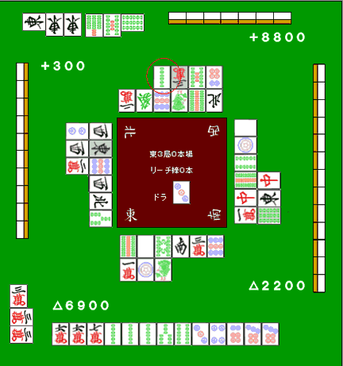

# 食断

断幺九即使鸣牌也能成立，所以是一个非常实用的手役。

但也不能因为它容易和，就什么手都拿去做食断。

**例1**

　　宝牌

像这样的牌，不能从序盘开始就一路鸣成 1000 点。

这明明是很有机会做大的牌，一旦急着鸣，反而把整手牌的价值毁掉了。

那什么情况下才该去做食断？

## 宝牌或赤牌有 2 张以上

如果手里已经有 2 张以上的宝牌，从打点角度看，就没必要再死守门前了。

**例2**

　　自摸　　宝牌

例2里就该切，先把断幺九确定下来。

之后只要出来，就都该毫不犹豫地吃。

断幺九里如果还带着 3 张宝牌，就应该狠狠干脆地鸣牌抢和。

## 只要和了就行的局面

比如南四局，自己只要比现在第二名略微多和一点就能逆转到第一。

这种情况下，就算是平时舍不得鸣的好形手牌，也应该拿去做 1000 点的食断。

**例4**

这种牌，有些局面下就是应该鸣牌去和。

　　　　

有人会觉得“这么好的形，鸣了太可惜”。

但如果目标是赢牌局，就必须在该仕挂的时候果断仕挂。

## 门前已经来不及了

真正擅长鸣牌的人，不光副露手法好，更重要的是鸣牌时机抓得准。

**例5**

　　宝牌

例5也是冲满贯的手牌，但再大的手，和不了就没有价值。

这手还只是两向听，离听牌还有一段距离。如果巡目已经很深，或者别人看起来明显更快，就必须放弃门前，转而副露。

像这种场况，应该对喊碰。

当然很想通过门前立直一次把失分追回来，但当两家已经开始动手时，就不能再继续慢慢等了。

尤其你是庄家时，更应该为了连庄，比子家更早地下决定。

要是做牌太悠闲，很可能直接把宝贵的亲番送掉。

前面举的例子，牌形都还不错。那坏形呢？

**例6**

　　宝牌

就算打错了，也绝不能从这种牌形开始食断副露。

确实，不做食断大概也很难和。但这种“就算做食断也未必和得了”的烂手，应该老老实实忍住，继续门前打。

　　吃　　碰

这种鸣法，只能留给那种“南场亲番、这局亲落就直接坐稳末位”之类被逼到极限的时候。

因为一旦对手立直，这种食断手在防守上的风险太大了。

从东场开始就这么乱鸣，只会让后面越来越难打。

牌形差、打点又低，这两点同时成立时就不该鸣。尤其食断手的守备力很低，可以说是最容易放铳的副露之一。

既然决定鸣，就必须尽量保证能和到底。要做 1000 点、2000 点的食断，最好还是建立在好形前提下。  
