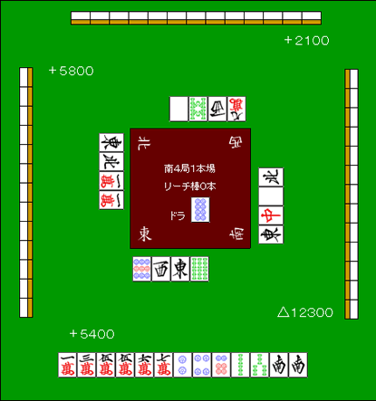

# 后付（2）

上一次提到：如果手里有 2 到 3 张宝牌，很多时候即使是后付，也应该积极副露。

除此之外，还有一些牌形和场面，同样很适合以后付方式推进。

## 关键张打出来了

**例1**

　　宝牌

比如这手牌，上家打出了。

这毫无疑问就是本手的关键张。要是把它放过去，剩下就只还有 2 张了，而且其中 1 张还是宝牌指示牌。

都靠自摸补齐，难度非常大。

所以这里应该用边张吃牌，做成后付。

　　

之后尽快处理掉，并且在手里留 1 张安全牌。

或者，如果再摸到 1 张役牌，也可以把它留下。

这看起来很像典型的后付副露，但大多数对手其实并不能完全把你封死，所以牌往往还是会打出来。

反过来说，真把牌抱死不放的人，也通常不会再全力进攻。既然如此，就算把宝牌面子亮出来，也不会降低你的防守力，这是完全没问题的副露方式。

## 双保险的后付

如果只靠役牌做后付，很多手牌会显得不太好动。

这时，如果还能顺便保留三色或一气通贯的可能，就会更有效。

**例2**

　　宝牌

例2里，只要出来，当然都应该吃。这样就能把三色和白牌后付同时放在天平两端去比较。

**例3**

例3如果有人打出，那就是毫不犹豫碰的一手。

因为这手牌不用太担心“摸到另一边却和不了”，而且一旦摸到或，还会变成三暗刻对对和。

## 无论如何都想和的胜负处

到了南场，经常会碰到一种局面：和牌点数已经不重要，关键是无论如何都要先和一次。

最典型的，就是南四局僵持，谁和牌谁逆转。

**例4**

像例4这种点数状况，如果还等着出来再说，就太温吞了。

这是就算一路吃碰到底，也要先把 1500 点和出来的局面。能鸣的全都应该鸣，当然 5 万碰掉不行。

这种南四局的贴身肉搏里，对手也会拼命抢先和牌，几乎没有余力去把役牌完全按住。

所以，后付在这种场面就会成为非常有效的战术。  
