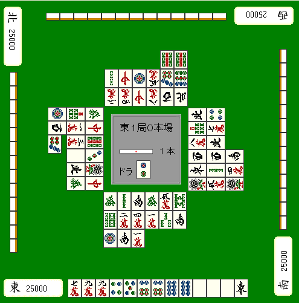

# 鸣牌技巧（3）

这一页讲的最后一类鸣牌技巧，不是为了推进自己和牌，而是为了**妨碍别人和牌**。

这类操作有些人会觉得不舒服，所以真在实战里用时，要有分寸。

## 消一发

只要立直后有人鸣牌，一发权利就会消失。  
不过一发本身命中的概率不算特别高，所以没必要为了消一发去承担明显风险。

但如果这件事**完全没有风险**，那当然做了更划算。

像上图这种情况，自己已经不现实再去争听牌了。  
这时就可以鸣掉 ，单纯把一发消掉，然后开始拆  的暗刻。

## 妨碍碰

如果同一张牌既有人能吃，也有人能碰，原则上碰优先。  
当然，有些桌规会规定“如果吃的发声明显更早，就让吃优先”。

也正因为如此，你有时可以通过碰牌，直接妨碍对手想吃的那张牌。

## 海底错位、海底消失

如果别人海底自摸，会多 1 番。  
因此终盘有人立直后，如果你能把海底消掉，通常是更稳妥的。

尤其是连庄规则下，只要让亲家的最后一次自摸消失，往往就已经很有价值。

反过来，如果你是在终盘为了取形式听牌而乱吃牌，结果反而让立直者多摸一次，那就未必划算了。

## 不以和牌为目的的杠

很多人随便开杠，会被看成初学者。  
但如果你知道杠的隐藏作用，有时反而能赚。

例如，假设下家已经立直，而他的最后一次自摸正好是海底牌。  
这时如果你手里有杠材，就先留着，等轮到自己最后一次自摸时再开杠。

这样一来，海底牌就会往后错一张，同时把立直者的最后自摸和海底役都一起抹掉。

通常会说：自己已经副露时，应尽量少杠，因为杠会给别人翻开新宝牌。  
但也存在反例。

如果你现在是末位，有时就算是大明杠，也反而值得考虑。

因为杠的意义不只是“我自己有机会摸到杠宝”。  
局面一旦通货膨胀，其他家更容易做成大牌，也可能出现“另一个人点进大牌，自己名次上升”的情况。

甚至在自己是 2 着、而竞争对手是微差 1 着且坐庄时，只要场上正好有末位立直，也可以考虑用开杠来增加亲家被炸的可能。

这个思路的前提是：

1. 自己手里有足够的安全牌，能稳稳弃和
2. 不用担心被末位反超

条件都满足时，这种“并非为了自己和牌”的杠，确实值得一想。

---

---

原始日文页：<http://beginners.biz/naki/naki15.html>
