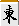

# 进攻和牌牌防守决策的黄金法则

作为一名雀士，光靠每次进攻是无法取得好的效果的。
 
然而，如果你不攻击，你的积分根本不会增加。

麻将玩家必须决定是“攻击”还是“起源”。
 
这就是“攻防判断”。

判断进攻和牌牌防守取决于击球手的感觉。
 
例如，在赌博游戏中，您支付 1000 日元，每 3 次获得 2000 日元。
 
谁都知道这是一种损失。

不过，是麻将，对方牌面朝下。你无法知道分数或分数。你的手牌上升的概率和牌牌你切掉危险牌并将其转移给对手的概率都是不明确的。

不確定要素だらけのこのゲームで、どのようにして「押した方が得」か「引いた方が得」かを判断すれば良いのでしょうか・・・

在讲“攻防判断”的技巧之前，我想先写一下攻防判断的基本思想。

## 不要根据结果来判断

麻将初心者の多くは,、勝ったから「正解」、負けたから「不正解」だと考えていますがこれはとんでもない誤りです。

例如，当你的父母试图帮助你重新站起来时，

　　ツモ　　　宝牌

第一个镜头击中了普通 。
 
之后，他继续维护易向奇，完成了。

直後に親がを掴んでこの局は１０００点で立直をかわし切った。

レベルの低い対局ではこのような光景をよく見かけます。
 
果たしてこの打ち手の選択は正解だったのでしょうか？

答案是否定的。
 
和牌牌有资格阻止他父母这样做。 ── 这种事情只是结果而已。转移的积分有可能达到12000点。如果仅仅因为某件事碰巧“成功”，就认为它是“正确的”，那就太简单化了。

此外，认为“这就是我带来运气气气的方式”是危险的。

我要把迄今为止我花在麻将身上的所有时间都打赌。
好运气气不会因为你自己的琼脂而降临到你身上。
长期以来，人们一直说“击球笔直可以改善球流”。我不知道为什么这种神秘主义仍然存在，但我也曾经相信过这个故事。然而，当我继续攻击麻将时，我每次都遭到背叛，每次都感到无助。处死了多少只老鼠？这是一个完全可怕的故事。
这有点题外话，但非常重要的是不要根据结果来判断雀士。 
即使结果很糟糕，
如果您认为自己做出了正确的选择，请坚持下去。
不要让暂时的结果欺骗你做出错误的选择。
有目标感
如果你只是想享受阿育，你只需要了解Agarikata。 
只需“推动”就足够了，无需考虑“进攻或防守决定”。
然而，现在阅读此页面的人是
“我想增加麻将雀士的收入和牌牌支出（或减少损失）”
“我想在朝桥游戏中获得高排名。”
您可能有这样的目标。
如果您有目标，请选择实现该目标的最佳策略。
如果您的目标是使用高小费比率的规则来增加收入和牌牌支出，
进攻和牌牌防守的决定也需要符合规则。
或者Tenho，最后的比率越低，积分越有利。
如果你的目标是七段或更高，你应该专注于它并专注于防守。
这不是实现目标的最快方法吗？
作为一名雀士，你想成为什么样的人？ 
如果这种目的感模糊，进攻和牌牌防守的判断也会变得模糊。

由于个体差异，课程中会进行概括，
 
「规则」和牌牌「玩家的目标」也是决定进攻和牌牌防守的重要因素。

## 设定自己的标准

“这一定是一种愚蠢的形式，因为他恢复得很快。”
 
“我今天不运气气好了，所以我们就停下来吧。”

很少有坚强的人会根据这些“信念”来做出进攻和牌牌防守的决定。
 
用毫无根据的预测作为决策的基础不会产生好的结果。

作为雀士，你要处理看不见的事情。
 
我倾向于选择“以某种方式”。

为了减少这种“不知何故”，你需要依赖你所看到的，创建你自己的标准，并捍卫和牌牌捍卫这些标准。

然后，一边查看结果一边继续输入和牌牌修改。
 
进攻和牌牌防守决策将变得更加复杂。

过去，除非你把结果记录在笔记本上，否则你无法客观地回顾自己的麻将。如今，有一些有用的游戏，例如麻将游戏，它们非常适合跟踪您的表现。如果射击率很高，现在更容易进行调整，例如更具防御性地射击。

然而，如果你一开始就设定了不好的标准，你可能无法提高。
 
因此，我将提出进攻和牌牌防守决策的基本标准。

あとは実際に打ってみて、
 
自分の打つルールや目的に合わせて微修正していけば良いと思います。

"自分に似合う服を探すように"
 
自分の納得できる攻防判断のバランスを見つけてください。
 
この講座はそのためのちょっとしたアドバイスです。

只要你了解了基础知识，
 
即使你逼得太紧或者防守得太多，你的结果也不应该太差。

