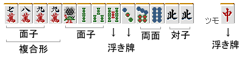

# 用瓦片击打

配对是一种有效完成四面子一帕图的理论。
这就是 麻将 手工工艺品背后的基本理念。
有一个词具有类似的含义，“牌效”。

如果您将“Masho”游戏视为一款游戏，

**“四人之中，谁能先完成四面一白的头部？”**这是一场你竞争的游戏。

因此，根据瓷砖质量选择要切割的瓷砖是基本的。

麻将雀士的手牌有“速度”、“高度”、“防御”三要素。
其中，速度是最重要的。
这是因为速度可以覆盖高度和牌牌防守。

不管你的牌有多高，如果你不赢，你的分数就无法增加。
如果你提前获胜，你就阻止了对手未来可能出现的动作，因此你可以将其视为为你的实际分数添加额外的分数。

另外，如果你在对手出牌之前输了钱，你将无法转移。速度是“瓷砖的生命”。请记住，您最不想做的就是因角色而分心并错过角色。

**“虚假的辉煌只会延迟崛起。”**

这是漫画《Aburemon》中的台词。这是一句著名的名言。

介绍完毕，让我解释一下“用瓷砖击中”的含义。

例子

例如，您如何看待这手牌？

如果你能看到吟唱者并用剑完成上脸，你就可以瞄准三种颜色。
初学者想知道他们记得自己可以扮演哪些角色。
只要想想这一点就很容易。

所以，

津莫宝牌

这里我经常犯错误，比如剪头发。

重要的是要考虑手中 13 张牌 (+1) 的组成。

手牌看起来像这样。

四面一和牌牌的头缺少了什么？两面小孩和牌牌雀头就完成了。

由于两边都可以计算出一面子，所以剩下的就是一面子了。

没有其他拖曳，所以它们保留下来。它必须由

如果是的话，哪一个最难制作？

这么一想，麻雀士该砍什么呢？
您将毫不费力地得到答案。分析手中的牌，选择需要消除的牌，
您所要做的就是比较瓷砖。

重要的是**“比较”**。通过比较，可以大大减少切割误差。

有了这个手牌，我不会用它来打Menshi或Toshi。候选瓷砖被切割。

弄清楚每个瓷砖有什么功能，并思考哪些瓷砖是最不必要的。

**反复列出和牌牌比较候选人。**
这就是打瓦的意义，也是朝的基础。

