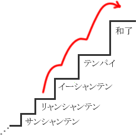

# 功效及瓷砖数量

朝日是指不断地从手中的牌中剔除一张不需要的牌的过程。
上次我说过，选择牌子时，以获胜的容易程度为最高优先级是基本的。

那么，在选择时具体应该考虑哪些因素呢？

## 1. 数量和概率

**实施例1**

示例 1 是除非太危险切。

我们再想一想。为什么或者是不是剪错了？

当然因为最好把它剪掉。
我们来实际比较一下。

听

听

上面有7块，下面有3块。 
当然，可能还有一些牌与其他玩家的手牌和王牌混合在一起，所以不会只剩下七三张。

很可能堆里连一个都没有了。

然而，没有办法确定堆里到底还剩下多少块。
我们不是通灵者。

实际上，我们比较7件和3件的理想值，可以判断做出来比较有利。

**“数量越多越好。”**这就是奈叶的基本原则。
如果忽视这个基本原则，你就无法赢得阿斯玛将军的胜利。

用这样的思维去扮演一个将军是很重要的。
阿修罗不是直觉游戏，而是**一款考验你盈亏意识敏锐程度的游戏。**就是这样。

## 2. 接受张数

示例 1 比较了瓷砖情况下的效果，
即使你手上没有任何牌，如果你能比较手中牌的数量或多或少，你就能清楚地看到哪些牌应该被丢弃。

让我们再次提出这个图。

当距离很远时，很难想出直接到达阿加里的最短路线。首先，以最短的距离为目标（如果是两象棋，则为一象棋），并考虑尽可能接近阿加里。

从瓦片数量来考虑攻击难易程度的最简单方法是比较可以减少瓦片数量的瓦片数量。

**实施例2**

例2是梁湘琪的手。
如果列出用这手牌变成易象棋的津麻牌，

共有7种23张。

这是“易向奇接受的门票数量”。

**实施例3**

实施例3与实施例2的形状几乎相同，但是
虽然她是个孩子，但她也是梁湘琪。

有 13 种 35 块瓷砖。

接受的张数远高于示例2，
很明显，示例 3 的形状比示例 2 更好。

这样，通过计算接受的牌张数，就可以定量地评估你的手牌。

根据接受的张数进行的评估将在后续课程中多次重复。

## 3. 有利的变化

津莫

如前面的数字所示，

以例2的形式

如果你减去如果你剪
象棋数量与梁象棋相同，但受理张数会增加。

您还必须将其视为有效的门票。

有效卡上

A：减少移动次数的图块（已接受）B：增加A数量的瓷砖（正变化）

有两种类型。

**实施例4**墨水津莫

例4是TORI的选择。

现在的上边，杠长切割后接受的件数也相同，为 4 件。
那么让我们来比较一下积极的变化。

津莫增加张数

津莫增加张数

既然有三处变化，那么接收它为 Shanpe 是正确的。

如果接受的纸张数量没有差异，则有一种方法可以比较形状发生变化的纸张数量。这里重要的是**被接受的项目数量比积极变化的数量更有价值。**这就是它的意思。

第一的**瓷砖有效性的基础是仅比较接受的纸张数量。**是。

A：减少目的地数量的图块（已接受）

B：增加A数量的瓷砖（正变化）

有一些人对A和B一视同仁，用“A+B”来比较张数。
一定要小心，因为很容易被误解。

