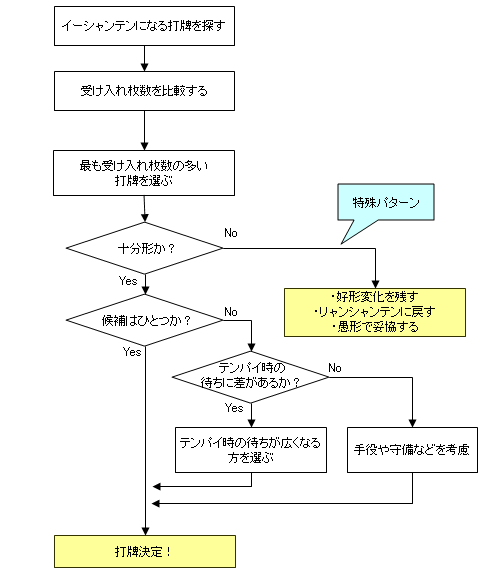

# 一向听牌理（1）

一向听阶段的牌理，是手作中最关键的技术之一。
因为它会直接影响和牌率。

远离和牌的手牌，效率差一点问题不大；
但临门一脚时的失误，往往是致命的。

## 1. 基本思路

一向听时可先按下面的流程判断：

流程图由上到下阅读，菱形为分支。
最难的是“特殊模式”：
即使是受入最多的打牌，也仍不能算“足够好”的情况。

## 2. 基本模式

“是否足够好”没有绝对标准。
我个人把“受入16枚以上”作为及格线。

这个门槛看起来高，但即使有16枚受入，平均也要7-8巡才听牌。
一局只有18巡，实际上已经很紧。

**例1**

打  的一向听受入为16枚，可视为及格。
虽然索子先入会变成愚形听牌，但还不至于为了这个去牺牲4枚受入。

当最大受入的打牌不止一种，或只差1-2枚时，
就要比较“最终听牌质量”是否有差别。

---

**例2**

打  与打  都是16枚受入，
这时要看听牌形，通常打  更容易得到两面听牌。

---

**例3**

这是“足够好”的形，受入和待型差异都不明显，
可按手役价值保留 ，走678三色路线。

## 3. 不足形

**例4**

受入只有12枚，属于不足形。
这时要优先考虑好形变化能力。

浮牌  和饼子连续形相比，
后者构成两面听牌的能力更强，所以这里应打 。

---

**例5**

这手除了取一向听，还存在“退回两向听”的选择。
因为自己已经用掉1张， 听并不理想。

麻将的难点就在这里：
并非所有局面都一定是“强行取一向听”最优。
还要考虑手役（打点）和立直后胜率（防失点能力）。

这手我更倾向打 。

### 本节总结

1. 先比较受入枚数。  
2. 受入接近时比较听牌质量。  
3. 形不足时优先考虑好形变化能力。  
4. 必要时可接受“退向听”来换取整体 EV。
