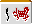

# 听牌时的牌理

听牌时多数情况并没有选择空间。
但只要可以选择待牌，基本原则就是选“最容易和牌”的等待。

## 1. 等待张数

等待张数越多，当然越容易和牌。
所以第一原则永远是优先选择张数更多的待牌。

**例1** 自摸 碰

例1共有4种待牌选择。

| 打牌 | 和牌牌 | 张数 |
|---|---|---|
| 切 |  | 3枚 |
| 切 |  | 6枚 |
| 切 |  | 4枚 |
| 切 |  | 10枚 |

全部比较之后就很清楚：这里应当是  切。

但很多人对多面张不熟时，很容易凭感觉去取双碰。
其实这种三面张一点也不罕见，形记熟了之后，这类选择应该能很快完成。

---

**例2** 自摸

需要强调的是：待牌种类再多，只要总张数少，也没有意义。
例2就是“不该取三面张”的典型。

| 打牌 | 和牌牌 | 张数 |
|---|---|---|
| 切 |  | 5枚 |
| 切 |  | 6枚 |

虽然看起来是三面待，但实际张数比另一边还少，甚至不如延展单骑。
而且已经成型的一杯口高概率会被拆掉，
所以例2应当选择  待立直。

## 2. 比较手变

当待牌张数没有差别时，就比较“向更好待牌变化”的机会。

**例3** 碰

这里常见选择是：取坎张，还是取双碰。
两边初始待牌都只有4枚，不能靠直觉，要算好形变化。

这是一手食断，所以即便变成两面，若是片和也不值得。
 与  这类变化，并不能真正算有效。

如果取双碰，有效手变是 ；
若取坎张，则真正有效的变化只有 。

所以这里应优先取双碰。

---

**例4** 自摸 吃

这是一组看起来差不多的两坎选择，原则上应优先取坎 。

原因是两边的有效牌虽然分别是  与 ，
但  还能从上家吃入，手变更容易实现。

这已经是把“鸣牌可能性”也计入手变价值的更进阶思路。

---

更简单一点，也可以结合场况判断。

如果两坎里有 `3-5-7` 这样的结构，而场上某侧相关牌已经切出很多，
那么就要意识到，某些手变即使理论成立，实战价值也会显著下降。

## 3. 单骑与坎边张的取舍

单骑与坎张/边张的选择也要特别小心。
有些局面即使张数少，也应该取单骑。

**例5** 自摸

这里边张有4枚，单骑只有3枚。
但不能因为“边张多1枚”就草率立直。

更好的思路是：先单骑默听，等待手变；
若能变成两面以上，再立直。

尤其当手里有中张暗刻或连续顺子时，手变枚数会非常多。
例5里， 都能把它变成好形立直。

所以这里完全值得先保留立直，等待更好的变化。
