# 立直のセオリー(1)

以下是有关恢复的一些基本理论。

## 基本原则是站直

初学者中经常看到的是

站在栾的位置上转了几圈后，突然又和牌牌妻切站了起来。

**示例1**
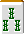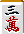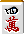 宝牌

一手変わり三色だったりするのですが、

こんなのは听牌牌牌したらすかさず立直といくべきです。

更改为 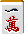 有两种，但等待不利。

「手変わり枚数　＞　アガリ牌の枚数」ならヤミテン

とする説もありますが、これはもう古い考え方。

如果你的对手用 。

如果是这样的话，我会在第一轮比赛后重新站起来。

**示例2**
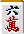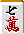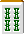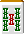自摸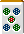宝牌

これも即立直が正解。

就算你和牌牌路琪打了个便宜的赌注，你也可能会错过，或者你可能会等几个回合再下定决心。

这只是一个糟糕的选择。

**「１発のタイミングを探っている」なんてギャグでしかありません。**

等待恢复的时间越长，一次性康复的可能性就越小。

### セオリー

在最终比分的时候，判断是恢复还是最终决定。
如果你想重新站起来，就当场重新站起来。
只要情况不改变，就是路琪。

## ２．ツモあがりが基準

“我不会这样生气的……”

这也是初学者经常有的消极想法。

**示例3**
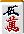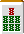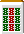宝牌

宝牌またぎだろうが、捨て牌に があろうが堂々と立直すればいいのです。出なければツモるまで。両面听牌牌だからツモれる可能性は十分あります。

**示例4**
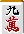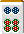 宝牌

碰禅抱牌奇，这是比较难出现的。

在千奇里等待I-P-Ko是一种被动的玩法。

即使情况无望，鱼仍有上涨的可能。

如果幸运气气的话，您将获得 1,300 或 2,600 点积分，所以您应该会康复。

除了单手格斗之外，你不需要过多考虑就能施展强力攻击有多容易。
不管你的对手有多强，如果你的对手是好胜的玩家，你就能赢，但如果你的对手强迫你，即使你认为你能从出牌中获胜，你也赢不了。

与其这样，我觉得还是根据图块的数量和牌牌图块的数量来思考比较好。

