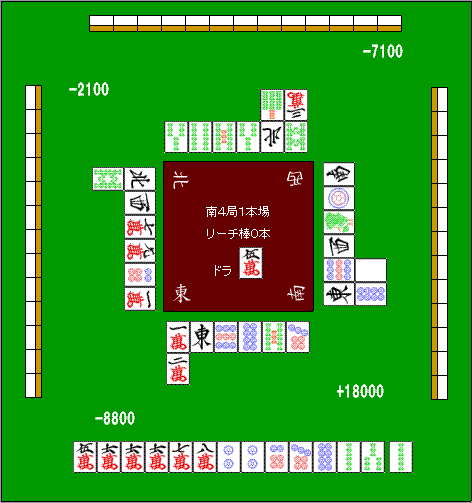

# 断幺九

断幺九最大的价值，归根结底就在于：**副露以后也能和牌**。

尤其是在红宝牌很多的规则里，食断的威力非常大。  
“断幺宝牌赤赤，8000！”这种牌型在实战里并不少见。被别人和到当然很烦，但反过来说，也正因为它威力大，才会出现“居然得对食断弃和”的局面。

有些店甚至对赤牌还有额外祝仪，这也让断幺九越来越接近“最强的常用手役”。

## 1. 朝着断幺九的方向去打

断幺九不仅容易做，而且很容易和其他役复合，是非常方便的役种。  
所以，实战里经常要主动考虑“能不能把这手往断幺九上靠”。

**例1**  

这手应该先拆掉  这组对子。

理由是：

1. 如果摸到 ，就能往断幺平和推进。
2. 如果摸到  或 ，还可以看到断幺三色。

也就是说，这里把幺九牌处理掉，未来的价值明显更高。

---

**例2**  

这里要把  和  对调，也就是切掉 ，留下 。

因为一旦以后摸到  或 ，这手就能自然转成断幺九。

## 2. 主动把断幺九“定下来”

**例3**  

这是典型的“面子过剩”牌形。  
这里的正确答案，一般都是拆掉 。

原因是：就算以后摸到 ，也只是立直 nomi，价值很低。  
不如趁现在就把幺九入口封死，明确把断幺九做成主线。

---

**例4**  

如果只看眼前的进张数，切  会更宽。  
但正常来说，还是应该切 。

因为一旦切掉它，断幺九就被固定下来：

1. 以后可以直接考虑食断副露。
2. 这手还顺带保留了 `456` 或 `567` 的三色可能。

也就是说，牺牲一点表面的手广，换来更清晰的手役路线，是值得的。

## 3. 连副露路线也要提前考虑

**例5**  

这副手如果单纯从“进张最多”来看，最佳是一张切 。  
但原文作者在实战里切的是 。

理由是：这是南四局的亲家，而且自己现在是第 4 名。  
这种局面无论如何都得和牌，所以这一打已经把“食断也要和”纳入考虑。

如果这里切 ，那么将来碰到  或  时，就会变成片和了。

例如最终牌型可能变成：

 吃 荣和

结果是成功和出了 5800。

这例子想说明的是：  
**断幺九不是只在手牌里“顺便有”才做，而是可以在关键局面里，连未来副露路线一起提前设计。**

---

---

原始日文页：<http://beginners.biz/teyaku/teyaku05.html>
