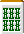

# 砍掉九个

丹圭最大的优点就是哭了也能站起来。

尤其是最近充满红色的免费赠品，禁食的力量是巨大的。

“8000 红红红！”是我经常听牌牌到的一句话。如果发生的话我会很生气。有时不得不停止进食是一件多么可怜的事情。
有的店家甚至赠送红色宝牌贺礼，禁食正在成为“禁食最有力的角色”的象征。

## １．断幺九になるように打つ

断幺九は作りやすい上に他の役と複合しやすい便利な役です。

そのため、断幺九の可能性を考えて打つことが重要。

**示例1**

在示例 1 中，我们删除 。

如果你拉，你可以瞄准tanpin，
 或 
如果拉动 ，还可以看到 93 种颜色。

 **例２**

在示例 2 中，替换  与 。
 这是因为当你拿起它时，你会被切断。

## ２．断幺九を確定させる

上图就是所谓的“过头”的情况，但是正确的剪法是什么呢？

これは  を落とすのが常識。 が来てもリーのみだからね。

最后一名的家长，目前排名第四。

这是一个我无论如何都想赢的场景，所以我也会考虑奎坦。

 切りでは  や  を碰したとき片上がりになってしまいます。

 吃 Ron

结果我筹集到了5800元。

