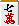

# 对子手(2)

让我们记住如何瞄准日子及其理论。

## 1. 七子和孟什特的转折点

基本上，如果 Menkote 和 Nanakako 的方向数相同

**Menshi-te 被更广泛地接受并且更容易获胜**

如果七子和Menkote的转化次数较低

（《七个孩子》中的梁祥琪、易祥琪）

你应该只关注那些诚实的人。

**示例1**
 Tsumo 宝藏瓷砖

当然，在示例 1 中，我根本看不到 Nanashiko，我输入 。

**示例2**
 Tsumo 宝藏瓷砖

然而，如例2所示，如果这七个孩子是易向奇，

如果我要动脸的话，如果是梁向奇我该怎么办？

简而言之，

- 孟什特手筋 → 内
- 七子的手筋 → 内（丢弃宝藏图块展示图块）

かつてはどちらか一方を決めるのが良しとされたそうですが、 

面子手と七对子どちらの可能性も残しながら打つのが現在の主流です。

打が、どちらにも対応できる手です。

主线是丹酒酒和宝牌2。 width="19" height="26"/> 不要扔掉抽出的七席。

虽然我可能会因为优柔寡断而受到批评，但我认为  切割是正确的答案。

**示例3**
 Tsumo 宝藏瓷砖

例３は面子手だけ考えるのであればツモ切りですが、

 允许您同时瞄准两者似乎更好。

### 理论/总结

痛苦的脸和手离开七美子的眼睛

**示例4**
　Tsumo 宝藏瓷砖

例子4呢？

如果您的目标是两者，请剪切 。

剪裁还不错，但是例4的形状不错，

**即使我们保留七子的可能性，也很有可能最终会成为面子问题**，所以

最好玩的图块是 ，决定宝藏图块。

## 2. 七儿童营

**示例5**
 Tsumo

据说还是尽快开始康复比较好。

然而，在示例5中，立即应用修正是有问题的。

无论您在哪里等待，都很难感到不安。

即使有 ，单独行动是一种愚蠢的策略。

从卡牌数量来看，单马术只有3张。

尽管只有三张牌，但我认为你不应该等待那些你无法期望出现的牌。

では、どんな牌で待つべきかというと

人物瓷砖
基本的想法是等待一张容易玩的牌。
特别是在场上的单个瓷砖是一个很棒的技巧。
不仅可以志在巅峰，还可以志在巅峰。

1.9块瓷砖
它之所以有效，还因为它很容易发挥作用。
2.8的瓷砖也不错。

苏吉瓷砖挂钩

这是您的目标是一个良好的开始的时候。
即使你击中同一块肌肉
切4等1比切4等7更有效。        

墙砖挂钩
例如，当场上有4个三筒时，
等一两瓶。对手没有机会
剪掉吧。比苏吉瓦钩更有效。您还可以预期鱼会上升。

宝藏瓷砖
我默听得了6400分，如果我站起来拿起它，我就得满分。
当你想要做出大动作的时候。

单身骑士可以故意瞄准Deagari。

宅男式的单人马，只有一张牌在场是最好的。

**示例6**
 Tsumo

如果 是一个原始图块（没有正在播放的图块）， 是单件

你应该重新站起来。

冢中的卡牌数量分别是3张和2张，但击败的难易程度却有着巨大的差异。

### 理论/总结

当谈到单马术时，你故意选择可能出现的牌并等待。

